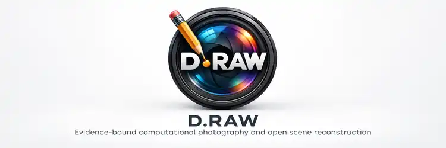

  

# D.RAW

> **CURRENT PROJECT IDENTITY — 2026-09-26**
>
> D.RAW is the current project/product name. Historical `TruthRaw` identifiers remain where required for provenance, sealed evidence, schemas, Android compatibility and reproducibility.
>
> Current bootstrap: `START_HERE_NEW_CHAT.md`
>
> Current state: `docs/DRAW_MAIN_PROJECT_STATE_2026-09-26.md` and `state/CURRENT_PROJECT_STATE_2026-09-26.json`
>
> Current active architecture branch: `architecture/lens-independent-free-world-observation-v01-2026-09-26`
>
> Latest Android-code branch: `research/appearance-highlight-headroom-sweep-v02-2026-09-26`
>
> The architecture branch is contract/documentation-only and does not alter the validated pixel route or APK.
>
> Default GitHub `main` is intentionally **not** the current development line; it still points to `514f2f4bde6aba5a6709e176c03b22c3b9aea912`.
>
> Current validated code checkpoint: `402c72d6804f6cc393a5eab93c9d94d0687be111`
>
> Current architecture now includes the SHA-256-sealed Lens-Independent Free World Observation Contract v0.1: **one Free World, many sealed observations, one evidence law**. Main, ultra-wide, tele and future sources enter through the same Observation Contract and source-specific Capability Envelope; TruthNegative stays per observation lineage; cross-source Zero-Line equality requires an admitted gauge relation; Float64 compute and validated Float32 storage remain authority-neutral.
>
> `DRAWObservationRecord v0.1` is the first executable derivative. CI run `36258955138` validates a real Camera-5 lamp-scene record and proves fail-closed rejection of cross-observation radiometric fusion when no common gauge is admitted.
>
> Recent code/evidence additions also include the N2 reconstruction-support closure, center-excluded predictor/spatial audit v0.2/v0.2.1, vector Confidence Field v0.3, Factored Confidence State v0.3.1, and two real Appearance highlight scenes. N2 and appearance diagnostics remain downstream and cannot write Scientific Master or TruthNegative.
>
> The real-device v0.1 white-exterior scene and the v0.2 lamp scene both show 100/100-nit exact peak-collapse with `source_censored=0`. In the lamp-scene sweep, 90/100 reduced the audit's exact collapsed-pair count from 941 to 0 while leaving below-knee mapped luminance unchanged. No default appearance winner has been promoted; the invariant 1058 gamut/display clamps remain a separate issue.
>
> Current signed ARM64 APK SHA-256: `d46b40c7650ad0b1102438bc1a31b1c4f8ee7c4c14050af633c435c5b0405e8b`
>
> D.RAW preserves the permanent rule: **representation can exceed the source; knowledge claims cannot exceed the evidence.**

> **HISTORICAL ACTIVE INTEGRATION — 2026-09-20**
>
> New chats should start with:
>
> 1. `docs/handoff/TRUTHRAW_NEXT_CHAT_HANDOFF_2026-09-19.md`
> 2. `state/CURRENT_PROJECT_STATE_2026-09-19.json`
> 3. `START_HERE_NEW_CHAT.md`
>
> Active branch: `integration/truthraw-suite-v0-72-projection-lifecycle-progress-fix`
>
> Current direction: one multi-vendor TruthRaw app with RAW-file import as the primary entrance and camera capture as the secondary entrance, converging at sealed source admission. DNG is native through the generic adapter ABI. **v0.72 keeps the v0.71 scientific content unchanged and fixes the Android DNG/TIFF/OpenEXR projection lifecycle: no fresh-job startup cleanup race, one projection at a time, persistent picker state, visible elapsed foreground progress and reliable terminal status. The real-device validated v0.63 PURE Float32 route remains unchanged.** The 16-bit Linear DNG is compatibility-only. v0.72 lifecycle fix: `docs/TRUTHRAW_V072_PROJECTION_LIFECYCLE_PROGRESS_FIX_2026-09-20.md`. v0.71 content foundation: `docs/TRUTHRAW_V071_OPEN_SCENE_TRR_ROLEMASK_EMBED_2026-09-20.md`. v0.70 foundation: `docs/TRUTHRAW_V070_CANONICAL_OPEN_SCENE_ROLE_BINDING_2026-09-20.md`. Remaining direct integration cables are explicitly tracked in `docs/TRUTHRAW_POST_V069_LOOSE_CABLE_ROADMAP_2026-09-20.md`. Nikon NEF remains fail-closed from Scientific Master pending noise/uncertainty, source-bound color and held-out validation.
>
> v0.70 CI run `35505972249`: **SUCCESS** on GCC, Clang, Open Scene v0.7/v0.8 scientific contracts and Android. Artifact ID `10603629201`; APK SHA-256 `43be7ac637f1e24d346c82ea8b3c717f4f2fd394fb3f977b490127db8eecca7d`.
>
> v0.68 CI run `35501501178`: **SUCCESS** on GCC, Clang, scientific contract tests and Android. Artifact ID `10602377966`; extracted APK SHA-256 `82a4fad83bc112067be00faf59609698daf742f19b71fcd65608e19e3b8c0d59`. The v0.67 scientific `.trr` format is unchanged; v0.68 makes the Android export transaction robust with app-private staging, foreground execution, header-last commit and staging↔destination whole-file SHA-256 equality. Real-device v0.68 background-switch validation is pending.

> **TruthNegative branch overlay — 2026-09-19**
>
> This branch develops the new **TruthNegative / Scientific Negative** reconstruction layer independently from the parallel HONOR acquisition-route research.
>
> Read first on this branch:
>
> 1. `docs/DOCUMENT_STATUS_INDEX_2026-09-19_TRUTHNEGATIVE_BRANCH.md`
> 2. `docs/TRUTHNEGATIVE_EXISTING_HOUSE_ALIGNMENT_AUDIT_2026-09-19.md`
> 3. `docs/CORE_VISION_TRUTHNEGATIVE_SCIENTIFIC_NEGATIVE.md`
> 4. `docs/CURRENT_TRUTHNEGATIVE_ARCHITECTURE_2026-09-19.md`
> 5. `state/TRUTHNEGATIVE_V0_2_EXISTING_HOUSE_BINDING_STATE_2026-09-19.json`
>
> TruthNegative v0.2 is a scientific-negative binding/projection family for the **existing** float Scientific Master/open-world house. It creates no second truth world, creates no new evidence, and does not replace the HONOR route investigation.

TruthRaw is a single-frame RAW reconstruction research project and software-ISP built around one permanent rule:

> **Measured where measured. Reconstructed where necessary. Never invented.**
>
> **Echt gemeten. Echt gereconstrueerd. Geen verzinsels.**

## Start here — current project knowledge

The living bootstrap for the consolidated 2026-09-16 research state is:

1. `START_HERE_NEW_CHAT.md`
2. `docs/CURRENT_SCIENTIFIC_ARCHITECTURE_2026-09-16.md`
3. `docs/CURRENT_SCENE_PHYSICS_RESTORATION_200MP_2026-09-16.md`
4. `state/CURRENT_PROJECT_STATE_2026-09-16.json`
5. `docs/DOCUMENT_STATUS_INDEX_2026-09-16.md`
6. `docs/PROJECT_HISTORY_AND_CHANGES_2026-09-16.md`
7. `docs/handoff/TRUTHRAW_CONSOLIDATED_HANDOFF_2026-09-16.md`

Older dated state files, handoffs, audits and module READMEs are intentionally retained as provenance. They remain authoritative for the exact experiment/module/version they describe, but they are not automatically the current global project state.

This integration line is built from the later 2026-09-16 open-world research state. It must not be confused with a canonical/main promotion. The repository default `main` may lag the active research branches; scientific promotion requires the relevant evidence and CI gates, not branch naming.

## Current scientific architecture

The original app-visible RAW/CFA bytes and capture metadata are immutable **Source Evidence**. The older “sealed house” metaphor remains useful historical language for that invariant.

TruthRaw reconstructs a separate **Scientific Master** in **Free Scientific Space**. The older “new house” metaphor described the discovery of this freedom, but the formal reconstructed world is not bounded by a house, room, frame container or display. It may represent interior, exterior, street, landscape, sky, distant geometry or other scene structure when supported as reconstruction.

Free Scientific Space is not permission to invent evidence. It means the representation is not forced to inherit RAW10, source `WhiteLevel` as an output ceiling, `[0,1]`, source ISO as scene identity, the original CFA lattice, integer storage, SDR or DNG container limits.

**Representation can exceed the source. Knowledge claims cannot exceed the evidence.**

Current high-level flow:

`sealed source evidence -> measurement/de-ISP -> Scientific Master in Free Scientific Space -> Dynamic Authority -> Open Scene State -> optional counterfactual/appearance state -> finite projection/export`

## Scene physics now explicitly bound

The current integration line treats light, colour, detail and HDR as coupled properties of one authority-bound scene state rather than four independent enhancement effects.

The forward chain is conceptually:

`illumination -> geometry/visibility -> material response -> outgoing radiance -> optics -> sensor/CFA/noise -> RAW evidence`

Important consequences:

- inverse-square falloff is conditional on source geometry; it is not a generic “farther from camera = darker” rule;
- shadows may alter direct, ambient and spectral illumination differently;
- relighting needs geometry/material/visibility/illumination support or remains `COUNTERFACTUAL`;
- source/DNG colour matrices can bind a reproducible transform but are not automatically independent physical calibration;
- CIE standard illuminants such as D65 are references, not proof of the actual scene illuminant;
- sample count is not optical resolution; SFR/MTF/detail authority needs its own evidence;
- scene radiance range, sensor evidence range, Scientific-Master representation range and display/HDR transport range stay distinct.

Detailed current rules are in `docs/CURRENT_SCENE_PHYSICS_RESTORATION_200MP_2026-09-16.md` and `docs/research/scene-physics-calibration-structure-hdr-v0.1/README.md`.

## Conservation/restoration is now a formal provenance model

TruthRaw's historical Restorer room is not a beauty filter. Professional conservation practice contributed a stronger operational rule:

> **Preserve the original, document the condition, separate intervention from original material, and keep compensation for loss detectable and retreatable where practicable.**

Digital mapping:

- valid measured CFA support is analogous to surviving original material and may not be overpainted in the scientific master;
- missing/damaged support may be reconstructed only under explicit support/provenance and remains `RECONSTRUCTED`;
- censored support remains a bound;
- unsupported loss remains `UNKNOWN`/unresolved;
- aesthetic reintegration may be visually seamless but has no scientific writeback;
- every repair remains traceable to source/master/authority/transformation identity.

The machine guard is `tools/restoration_authority_v01.py`, with regression tests in `tests/test_restoration_authority_v01.py`.

## Dynamic Authority

A reconstructed number is not sufficient by itself. TruthRaw also tracks what epistemic class is allowed to be claimed for it.

The current research line distinguishes at least:

- `MEASURED`
- `RECONSTRUCTED`
- `CENSORED`
- `UNKNOWN`
- `COUNTERFACTUAL`

Dynamic Authority grew from two earlier gates that remain important:

1. **numerical/promotion authority** — whether a compute/storage path is demonstrated safe enough to carry scientific state;
2. **local uncertainty/provenance binding** — whether uncertainty/support is bound to the same Scientific-Master quantity, coordinates and identity.

Missing or mismatched authority information fails closed. It is not replaced by an estimate merely to make the pipeline complete.

## Precision is stage-specific

TruthRaw does not use “more bits is always more truthful” as a rule.

The validated research direction is:

`exact packed/integer RAW evidence`
`-> F32 only in demonstrated-safe stages`
`-> F64 for branch-sensitive reconstruction`
`-> F64 for calibration / optimization / covariance`
`-> controlled F32 Scientific-Master storage only after F64 compute when the storage gate permits it`
`-> higher/arbitrary precision as a reference validator where useful`

A later cast from F32 to F64 cannot undo a branch decision that was already made differently in F32.

## TruthRange and zero-line

For positive physical scene light TruthRaw may use:

`T = log2(L/L0)`

`L0` is a reference/gauge. `T=0` is not sensor black, DNG `BlackLevel`, display black, clipping or zero photons.

TruthRange can be unbounded as a coordinate system while a real capture supplies finite evidence. Signed scene-linear estimates remain a separate companion representation. A negative numerical estimate is not negative physical light.

## Open world, rooms and execution resources

The earlier Building Runtime/12-room architecture remains a valid execution model and provenance layer. Rooms such as Measurement Lab, Restorer, Surveyor, CICM/Lighting Studio, Room Capsule, Colorist, Finisher and Exporter have authority floors.

The **open-world correction** is permanent: a Room Capsule bounds local computation, not the reconstructed world. The world outside a local room is not scientifically forbidden merely because it is outside that compute capsule.

Hardware resources remain orthogonal to scientific authority. A weak phone may use smaller tiles, less cache and lower concurrency; a strong phone may use more parallelism or acceleration. Neither receives extra evidence or permission to make stronger claims.

## Single-frame and counterfactual invariants

For the current master:

- `physicalFrameCount = 1`
- `independentEvidenceCount = 1`
- virtual views do not increase evidence count;
- counterfactual illumination/capture never retroactively becomes captured evidence;
- appearance/transport never upgrades scientific authority;
- exports never become a new Scientific Master merely because a viewer can display them.

A saturated CFA sample is censored evidence: it can support a bound, not an invented exact latent radiance.

A genuinely independent physical modality may add evidence only under a new explicit admission contract. Virtual exposure, relighting, tone, generative fill and restoration presentation do not.

## HDR and Adobe boundary

TruthRaw scientific HDR is derived from the Scientific Master plus authority/support, not from a display Gain Map. `UNKNOWN` contributes no scientific HDR headroom; a censored highlight does not get an exact invented radiance.

Adobe/Lightroom Gain Map handling is downstream presentation/display adaptation. Lightroom can be an HDR finisher; it is not allowed to decide retroactively what the captured scene scientifically contained.

## Current on-device validation

TruthRaw Android debug client v0.3 has a real target-device verification report for the frozen Honor source:

- schema: `TruthRawAndroidVerificationReport/0.3`
- classification: `DEVICE_VALIDATION_ONLY_NO_SCIENTIFIC_WRITEBACK`
- device: `HONOR BKQ-N49`, Android 16 / API 36
- result: `PASS_EXACT_SOURCE_AND_DECODED_CFA`
- source bytes: `25106120`
- source SHA-256: `7930ba5db0fe1b7b9dcc09e9337efbca76b8877fb78a6dc4667761bf25159b67`
- decoded CFA: `4080x3072`, `3072` strips, `25067520` bytes
- decoded CFA SHA-256: `883cbe13fd2a5afe7e9f3f4147df3a8ed3be681340a3c0422933f42d0f4d719c`

The report explicitly does **not** claim on-device recomputation of the Scientific Master, Dynamic Authority or HDR projection. It creates no new sensor evidence and permits no scientific writeback.

## FotoGraaf / Camera 5 / 200 MP boundary

FotoGraaf is acquisition/metrology upstream of reconstruction. The verified 4080x3072 tele route and the proposed maximum-resolution route remain separate claims.

Current static Camera-5 evidence advertises:

- physical camera `5`;
- `ULTRA_HIGH_RESOLUTION_SENSOR=true`;
- `REMOSAIC_REPROCESSING=false`;
- maximum pixel array `16320x12288` (`200,540,160` samples);
- high-resolution `RAW_SENSOR 16320x12288` and `RAW10 16320x12288` routes.

Android's UHR contract implies regular Bayer RAW_SENSOR when remosaic reprocessing is not advertised. The simultaneously reported `SENSOR_INFO_BINNING_FACTOR=2x2` is retained as vendor-metadata tension, not proof of a 2x2 same-colour app-visible CFA.

The new bounded contract guard is `tools/camera5_200mp_android_contract_v04.py`.

The physical gate remains open:

`OPEN_NEEDS_REAL_16320x12288_RAW_PAYLOAD_AND_TOTALCAPTURERESULT_BINDING`

A future successful real capture may prove `APP_VISIBLE_MAXIMUM_RESOLUTION_RAW_SENSOR_CFA_PROVEN`; it must not be relabelled `UNTOUCHED_NATIVE_200MP_ADC` without separate evidence.

4080x3072, 8160x6144 and 16320x12288 are separate sample/readout domains until measurements demonstrate model transferability. No uncertainty/calibration is borrowed merely because the physical lens/camera is related.

A 200 MP raster proof would still not prove 200 MP optical detail. SFR/MTF/PSF, noise/PTC, shading and colour/calibration remain separate gates.

## Current hard blockers

- the exact historical 10,023-byte `uncertainty_core_v5_0g.py` feature extractor has not been recovered; approximate semantic reconstruction is forbidden;
- a true qualifying 16320x12288 Camera-5 RAW_SENSOR + bound capture-result evidence set is still required for physical 200 MP promotion;
- FULL_PHYSICAL color/illuminant/optics claims remain evidence-gated;
- counterfactual light is hypothetical state, not captured evidence;
- restoration/loss compensation may never overpaint valid measured support or become measured by appearance;
- public API stability beyond the explicitly canonicalized interfaces is not implied by research success.

## Permanent boundaries

- source CFA/sample bytes and capture provenance remain immutable;
- measured/reconstructed/censored/unknown/counterfactual/appearance classes remain distinguishable;
- GainMap is applied exactly once where the relevant validated chain requires it;
- no semantic/generative texture is promoted into scientific evidence;
- APK/GCam/computational-RAW content does not determine TruthRaw scientific evidence or calibration;
- `canonical/ptc/v1.1` means **Pure Truth Certificate**, not photon-transfer calibration;
- failed/rejected/superseded experiments remain preserved as provenance;
- no open-source LICENSE is added unless explicitly chosen.

## Repository navigation

Use `docs/DOCUMENT_STATUS_INDEX_2026-09-16.md` before treating any dated README, report, audit or state file as current. Historical documents are kept precisely so later states can be audited against what was actually known at the time.

> v0.71 CI run `35506676249`: **SUCCESS** on GCC, Clang, scientific contracts and Android. Documentation governance `35506676288`: **SUCCESS**. Artifact ID `10604525855`; APK SHA-256 `5653f33c5bbf3263473ee89cfc70e1d0807ce0a529b258b61e3325b791700e46`.
